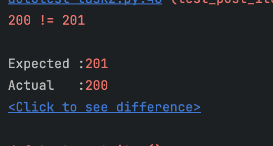
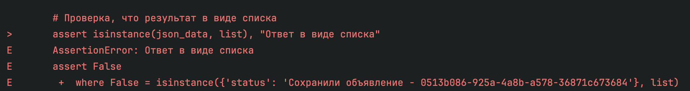

    Баг 1. Ошибка кода состояния запроса при создании объявления 
**Короткое описание:** Запрос на создание нового объявления, ожидался код состаояния 201 (создан), запрос отдал 200 (ок), который соотвествует методу GET, в данном запросе метод POST

**Серьезность:** Незначительный. Ошибка не блокирует функциональность приложения, но может вызвать проблемы в обработке ответов 

**Приоритет:** Medium

 

    Баг 2. Ошибка в виде ответа 

**Короткое описание:** Запрос должен отдать ответ в виде списка, по факту отдает в виде словаря 

**Серьезность:** Critical, Blocer. Ошибка блокирует корректную работу функциональности, которая завсит от правильного типа данных. Обработка неверных данных может привести к ошибкам работы приложения

**Приоритет:** High

