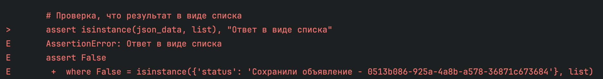

**Инструкция по запуску**

Шаг 1. Клонирование репозитория 

Шаг 2. Установка библиотек 

```pip install pytest```

```pip install random ```

```pip install requests ```

Шаг 3. Запустить тесты


Шаг 4. Посмотреть, если ошибки 




Шаг 5. Прочитать про баги можно, перейдя по ссылке в файле [BUGS.md](BUGS.md)
